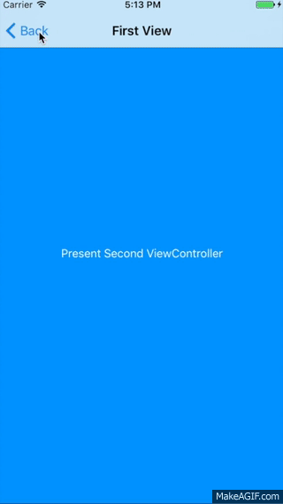
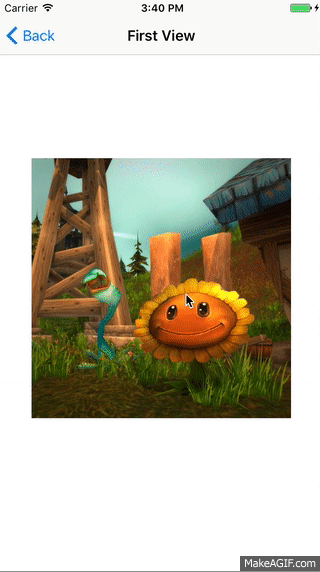
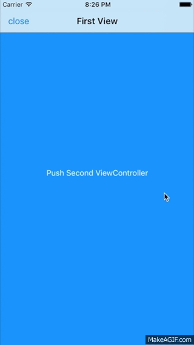

# AnimatedTransitionKit


[](https://travis-ci.org/pisces/AnimatedTransitionKit)
[](http://cocoapods.org/pods/AnimatedTransitionKit)
[](http://cocoapods.org/pods/AnimatedTransitionKit)
[](http://cocoapods.org/pods/AnimatedTransitionKit)
[](https://github.com/Carthage/Carthage)

- It's the very simple library to apply transitioning to between scene and other scene

## Features
- Simple integration of custom transitioning for UIViewController and UINavigationController
- Provides various types of custom transitioning
- Support percent driven interactive transtions
- Expandable

## Example
&nbsp;&nbsp;&nbsp;


## Transition types for UIViewController
- Move
- DragDrop
- Fade
- Zoom

## Transition types for UINavigationController
- Move

## Gestures
- Pan
- Pinch

## Import

Objective-C
```objective-c
#import <AnimatedTransitionKit/AnimatedTransitionKit.h>
```
Swift
```swift
import AnimatedTransitionKit
```

## 🔥Using UIViewControllerTransition

### Using ZoomTransition

```swift
import AnimatedTransitionKit

final class ZoomTransitionFirstViewController: UIViewController {
    
    // MARK: - Lifecycle
    
    override func viewDidLoad() {
        super.viewDidLoad()
        
        title = "First View"

        // View binding with any transition id
        button.transitionItem.id = "zoomTarget"
        
        let transition = ZoomTransition()
        transition.isAllowsInteraction = true
        transition.appearenceInteractor?.attach(self, present: secondViewController)
        
        secondViewController.transition = transition
    }

    // MARK: - Private
    
    private lazy var secondViewController: UINavigationController = {
        let rootViewController = UIStoryboard(name: "ZoomTransition", bundle: nil).instantiateViewController(withIdentifier: "SecondScene")
        return UINavigationController(rootViewController: rootViewController)
    }()
    
    @IBOutlet private weak var button: UIButton!
    
    @IBAction private func clicked() {
        present(secondViewController, animated: true, completion: nil)
    }
}

final class ZoomTransitionSecondViewController: UIViewController {
    
    // MARK: - Lifecycle
    
    override func viewDidLoad() {
        super.viewDidLoad()
        title = "Second View"
        navigationItem.setLeftBarButton(UIBarButtonItem(title: "Close", style: .plain, target: self, action: #selector(close)), animated: false)
        
        // View binding with matched transition id
        targetView.transitionItem.id = "zoomTarget"
    }
    
    // MARK: - Internal
    
    @IBOutlet private(set) weak var targetView: UIView!
    
    // MARK: - Private
    
    @objc private func close() {
        dismiss(animated: true, completion: nil)
    }
}

```

### Using MoveTransition Simply
#### Using single transition for dismission with pan gesture

```swift
import AnimatedTransitionKit

final class ViewController: UIViewController {

    // MARK: - Lifecycle
    
    override func viewDidLoad() {
        super.viewDidLoad()
        let transition = MoveTransition()
        transition.isAllowsInteraction = true
        navigationController?.transition = transition
    }
}
```

### Using MoveTransition Deeply
#### Using pair transitions for presenting and dismission both with pan gesture

```swift
import AnimatedTransitionKit

final class MoveTransitionFirstViewController: UIViewController {
    
    // MARK: - Lifecycle
    
    override func viewDidLoad() {
        super.viewDidLoad()
        title = "First View"
        secondViewController.transition?.appearenceInteractor?.attach(self, present: secondViewController)
    }
    
    // MARK: - Private
    
    private lazy var secondViewController: UINavigationController = {
        let viewController = MoveTransitionSecondViewController(nibName: "MoveTransitionSecondView", bundle: .main)
        let transition = MoveTransition()
        transition.appearenceOptions.duration = 0.25
        transition.disappearenceOptions.duration = 0.35
        transition.isAllowsInteraction = true
        transition.disappearenceInteractor?.delegate = viewController
        
        let navigationController = UINavigationController(rootViewController: viewController)
        navigationController.modalPresentationStyle = .fullScreen
        navigationController.transition = transition
        return navigationController
    }()
    
    @IBAction private func clicked() {
        present(secondViewController, animated: true, completion: nil)
    }
}
```


```swift
final class MoveTransitionSecondViewController: UITableViewController {
    
    // MARK: - Lifecycle
    
    override func viewDidLoad() {
        super.viewDidLoad()
        title = "Second View"
        navigationItem.setLeftBarButton(UIBarButtonItem(title: "Close", style: .plain, target: self, action: #selector(close)), animated: false)
        navigationController?.transition?.disappearenceInteractor?.drivingScrollView = tableView
    }
    
    // MARK: - Overridden: UITableViewController
    
    override func numberOfSections(in tableView: UITableView) -> Int {
        return 1
    }
    override func tableView(_ tableView: UITableView, numberOfRowsInSection section: Int) -> Int {
        return 50
    }
    override func tableView(_ tableView: UITableView, heightForRowAt indexPath: IndexPath) -> CGFloat {
        return 100
    }
    override func tableView(_ tableView: UITableView, cellForRowAt indexPath: IndexPath) -> UITableViewCell {
        let identifier = "UITableViewCell"
        var cell = tableView.dequeueReusableCell(withIdentifier: identifier)
        if cell == nil {
            cell = UITableViewCell(style: .default, reuseIdentifier: identifier)
        }
        return cell!
    }
    override func tableView(_ tableView: UITableView, willDisplay cell: UITableViewCell, forRowAt indexPath: IndexPath) {
        cell.textLabel?.text = "\(indexPath.row + 1)"
    }
    
    // MARK: - Private
    
    private var isInteractionBegan = false
    private var isViewAppeared = false
    
    @objc private func close() {
        dismiss(animated: true, completion: nil)
    }
}

// MARK: - InteractiveTransitionDelegate

extension MoveTransitionSecondViewController: InteractiveTransitionDelegate {
    
    func shouldTransition(_ interactor: AbstractInteractiveTransition) -> Bool {
        navigationController?.viewControllers.count == 1
    }
}
```

#### Using DragDropTransition

```swift
import AnimatedTransitionKit

final class DragDropTransitionFirstViewController: UIViewController {

    // MARK: - Lifecycle
    
    override func viewDidLoad() {
        super.viewDidLoad()
        
        title = "First View"
        view.addGestureRecognizer(gestureRecognizer)
    }

    // MARK: - Private
    
    @IBOutlet private weak var imageView: UIImageView!
    
    private lazy var gestureRecognizer: UITapGestureRecognizer = { [unowned self] in
        UITapGestureRecognizer(target: self, action: #selector(tapped))
    }()
    
    @objc private func tapped() {
        let secondViewController = DragDropTransitionSecondViewController(nibName: "DragDropTransitionSecondView", bundle: .main)
        let secondNavigationController = UINavigationController(rootViewController: secondViewController)
        
        let transition = DragDropTransition()
        transition.isAllowsInteraction = true
        transition.disappearenceInteractor?.delegate = secondViewController
        
        let w = view.frame.size.width
        let statusBarHeight = UIApplication.shared.statusBarFrame.size.height
        let navigationBarHeight = navigationController!.navigationBar.frame.size.height
        let bigRect = CGRect(x: 0, y: statusBarHeight + navigationBarHeight, width: w, height: w)
        let smallRect = imageView.frame
        
        transition.presentingSource = DragDropTransitioningSource.image({ () -> UIImage? in
            self.imageView.image
        }, from: { () -> CGRect in
            smallRect
        }, to: { () -> CGRect in
            bigRect
        }, rotation: { () -> CGFloat in
            0
        }) {
            self.imageView.isHidden = true
            secondViewController.imageView.isHidden = false
        }
        
        transition.dismissionSource = DragDropTransitioningSource.image({ () -> UIImage? in
            secondViewController.imageView.image
        }, from: { () -> CGRect in
            bigRect
        }, to: { () -> CGRect in
            smallRect
        }, rotation: { () -> CGFloat in
            0
        }) {
            self.imageView.isHidden = false
        }
        
        secondNavigationController.transition = transition
        navigationController?.present(secondNavigationController, animated: true, completion: nil)
    }
}

final class DragDropTransitionSecondViewController: UIViewController {
    
    // MARK: - Lifecycle
    
    override func viewDidLoad() {
        super.viewDidLoad()
        
        title = "Second View"
        edgesForExtendedLayout = .bottom
        imageView.isHidden = true
        
        navigationItem.setLeftBarButton(UIBarButtonItem(title: "Close", style: .plain, target: self, action: #selector(close)), animated: false)
    }
    override func viewDidLayoutSubviews() {
        super.viewDidLayoutSubviews()
        
        imageViewHeight.constant = view.frame.size.width
    }
    
    // MARK: - Internal

    @IBOutlet private(set) weak var imageView: UIImageView!
    
    // MARK: - Private

    @IBOutlet private weak var imageViewHeight: NSLayoutConstraint!
    
    @objc private func close() {
        self.dismiss(animated: true, completion: nil)
    }
}

// MARK: - InteractiveTransitionDelegate

extension DragDropTransitionSecondViewController: InteractiveTransitionDelegate {

    func didBegin(withInteractor interactor: AbstractInteractiveTransition) {
        imageView.isHidden = true
    }
    func didChange(withInteractor interactor: AbstractInteractiveTransition, percent: CGFloat) {
    }
    func didCancel(withInteractor interactor: AbstractInteractiveTransition) {
        imageView.isHidden = false
    }
    func didComplete(withInteractor interactor: AbstractInteractiveTransition) {
        imageView.isHidden = false
    }
    func interactor(_ interactor: AbstractInteractiveTransition, gestureRecognizer: UIGestureRecognizer, shouldReceive touch: UITouch?) -> Bool {
        return true
    }
    func interactor(_ interactor: AbstractInteractiveTransition, shouldInteract gestureRecognizer: UIGestureRecognizer) -> Bool {
        return true
    }
}
```

### Customize UIViewControllerTransition

```swift
import AnimatedTransitionKit

class CustomTransition: UIViewControllerTransition {
    
    override func animationController(forDismissed dismissed: UIViewController) -> UIViewControllerAnimatedTransitioning? {
        return CustomTransitioning()
    }
    
    override func animationController(forPresented presented: UIViewController, presenting: UIViewController, source: UIViewController) -> UIViewControllerAnimatedTransitioning? {
        return CustomTransitioning()
    }
}

class CustomTransitioning: AnimatedTransitioning {
    
    // Write code here for dismission
    override func animateTransition(forDismission transitionContext: UIViewControllerContextTransitioning) {
    }
    // Write code here for presenting
    override func animateTransition(forPresenting transitionContext: UIViewControllerContextTransitioning) {
    }
    // Write interative transition began code here for dismission or presenting
    override func interactionBegan(_ interactor: AbstractInteractiveTransition) {
        if self.presenting {
            // for presenting
        } else {
            // for dismission
        }
    }
    // Write interative transition changed code here for dismission or presenting
    override func interactionChanged(_ interactor: AbstractInteractiveTransition, percent: CGFloat) {
        if self.presenting {
            // for presenting
        } else {
            // for dismission
        }
    }
    // Write interative transition cacelled code here for dismission or presenting and call completion after animation finished
    override func interactionCancelled(_ interactor: AbstractInteractiveTransition, completion: (() -> Void)? = nil) {
        if self.presenting {
            // for presenting
        } else {
            // for dismission
        }
    }
    // Write interative transition completed code here for dismission or presenting and call completion after animation finished
    override func interactionCompleted(_ interactor: AbstractInteractiveTransition, completion: (() -> Void)? = nil) {
        if self.presenting {
            // for presenting
        } else {
            // for dismission
        }
    }
}
```

### Using CustomTransition

```swift
let transition = CustomTransition()
transition.isAllowsInteraction = true
transition.appearenceInteractor?.attach(self, present: secondViewController)

secondViewController.transition = transition
present(secondViewController, animated: true, completion: nil)
```

## 🔥Using UINavigationControllerTransition

### Using NavigationMoveTransition


```swift
import AnimatedTransitionKit

final class NavigationMoveTransitionFirstViewController: UIViewController {
    
    // MARK: - Lifecycle
    
    override var prefersStatusBarHidden: Bool {
        false
    }
    override var preferredStatusBarStyle: UIStatusBarStyle {
        .default
    }
    override var preferredStatusBarUpdateAnimation: UIStatusBarAnimation {
        .fade
    }
    
    override func viewDidLoad() {
        super.viewDidLoad()
        title = "First View"
        navigationItem.leftBarButtonItem = UIBarButtonItem(title: "close", style: .plain, target: self, action: #selector(close))
        let transition = NavigationMoveTransition()
        navigationController?.navigationTransition = transition
    }
    
    override func viewWillAppear(_ animated: Bool) {
        super.viewWillAppear(animated)
        print("viewWillAppear -> \(type(of: self))")
        UIView.animate(withDuration: 0.4, delay: 0, options: UIView.AnimationOptions(rawValue: 0), animations: {
            self.setNeedsStatusBarAppearanceUpdate()
        }, completion: nil)
    }
    
    override func viewDidAppear(_ animated: Bool) {
        super.viewDidAppear(animated)
        print("viewDidAppear -> \(type(of: self))")
        if let navigationController = navigationController {
            navigationController.navigationTransition?.interactor?.attach(navigationController, present: secondViewController)
        }
    }
    
    override func viewWillDisappear(_ animated: Bool) {
        super.viewWillDisappear(animated)
        print("viewWillDisappear -> \(type(of: self))")
    }
    
    override func viewDidDisappear(_ animated: Bool) {
        super.viewDidDisappear(animated)
        print("viewDidDisappear -> \(type(of: self))")
    }
    
    // MARK: - Private
    
    private lazy var secondViewController: NavigationMoveTransitionSecondViewController = {
        .init(nibName: "NavigationMoveTransitionSecondView", bundle: .main)
    }()
    
    @IBAction private func clicked() {
        navigationController?.pushViewController(secondViewController, animated: true)
    }
    
    @objc private func close() {
        dismiss(animated: true, completion: nil)
    }
}

final class NavigationMoveTransitionSecondViewController: UITableViewController {
    
    // MARK: - Lifecycle
    
    override var prefersStatusBarHidden: Bool {
        false
    }
    override var preferredStatusBarStyle: UIStatusBarStyle {
        .lightContent
    }
    override var preferredStatusBarUpdateAnimation: UIStatusBarAnimation {
        .fade
    }
    
    override func viewDidLoad() {
        super.viewDidLoad()
        title = "Second View"
    }
    
    override func viewWillAppear(_ animated: Bool) {
        super.viewWillAppear(animated)
        print("viewWillAppear -> \(type(of: self))")
        UIView.animate(withDuration: 0.4, delay: 0, options: UIView.AnimationOptions(rawValue: 0), animations: {
            self.setNeedsStatusBarAppearanceUpdate()
        }, completion: nil)
    }
    
    override func viewDidAppear(_ animated: Bool) {
        super.viewDidAppear(animated)
        navigationController?.navigationTransition?.interactor?.delegate = self
        print("viewDidAppear -> \(type(of: self))")
    }
    
    override func viewWillDisappear(_ animated: Bool) {
        super.viewWillDisappear(animated)
        print("viewWillDisappear -> \(type(of: self))")
    }
    
    override func viewDidDisappear(_ animated: Bool) {
        super.viewDidDisappear(animated)
        print("viewDidDisappear -> \(type(of: self))")
    }
    
    // MARK: - Overridden: UITableViewController
    
    override func numberOfSections(in tableView: UITableView) -> Int {
        1
    }
    
    override func tableView(_ tableView: UITableView, numberOfRowsInSection section: Int) -> Int {
        50
    }
    
    override func tableView(_ tableView: UITableView, heightForRowAt indexPath: IndexPath) -> CGFloat {
        100
    }
    
    override func tableView(_ tableView: UITableView, cellForRowAt indexPath: IndexPath) -> UITableViewCell {
        let identifier = "UITableViewCell"
        var cell = tableView.dequeueReusableCell(withIdentifier: identifier)
        if cell == nil {
            cell = UITableViewCell(style: .default, reuseIdentifier: identifier)
        }
        return cell!
    }
    
    override func tableView(_ tableView: UITableView, willDisplay cell: UITableViewCell, forRowAt indexPath: IndexPath) {
        cell.textLabel?.text = "\(indexPath.row + 1)"
    }
}

```

### Customize UINavigationControllerTransition
```swift
import AnimatedTransitionKit

class CustomNavigationTransition: UINavigationControllerTransition {

    override func newTransitioning() -> AnimatedNavigationTransitioning? {
        return CustomNavigationTransitioning()
    }
}

class CustomNavigationTransitioning: AnimatedNavigationTransitioning {

    // Write code here for pop without interaction
    override func animateTransition(forPop transitionContext: UIViewControllerContextTransitioning) {
    }
    // Write code here for push without interaction
    override func animateTransition(forPush transitionContext: UIViewControllerContextTransitioning) {
    }
    // Write interative transition began code here for push or pop
    override func interactionBegan(_ interactor: AbstractInteractiveTransition, transitionContext: UIViewControllerContextTransitioning) {
        if isPush {
            // for push
        } else {
            // for pop
        }
    }
    // Write interative transition changed code here for push or pop
    override func interactionChanged(_ interactor: AbstractInteractiveTransition, percent: CGFloat) {
        if isPush {
            // for push
        } else {
            // for pop
        }
    }
    // Write interative transition cacelled code here for push or pop and call completion after animation finished
    override func interactionCancelled(_ interactor: AbstractInteractiveTransition, completion: (() -> Void)? = nil) {
        if isPush {
            // for push
        } else {
            // for pop
        }
    }
    // Write interative transition completed code here for push or pop and call completion after animation finished
    override func interactionCompleted(_ interactor: AbstractInteractiveTransition, completion: (() -> Void)? = nil) {
        if isPush {
            // for push
        } else {
            // for pop
        }
    }
}
```

### Using CustomNavigationTransition

```swift
guard let navigationController = navigationController else {return}

let transition = CustomNavigationTransition()

navigationController.navigationTransition = transition
transition.interactor?.attach(navigationController, present: secondViewController)

navigationController.push(secondViewController, animated: true, completion: nil)
```

## Installation

### CocoaPods

[CocoaPods](http://cocoapods.org) is a dependency manager for Cocoa projects. You can install it with the following command:

```bash
$ gem install cocoapods
```

> CocoaPods 1.1.0+ is required to build AnimatedTransitionKit.

To integrate AnimatedTransitionKit into your Xcode project using CocoaPods, specify it in your `Podfile`:

```ruby
source 'https://github.com/CocoaPods/Specs.git'
platform :ios, '9.0'

target '<Your Target Name>' do
    pod 'AnimatedTransitionKit', '~> 4'
end
```

Then, run the following command:

```bash
$ pod install
```

### Carthage

[Carthage](https://github.com/Carthage/Carthage) is a decentralized dependency manager that builds your dependencies and provides you with binary frameworks.

You can install Carthage with [Homebrew](http://brew.sh/) using the following command:

```bash
$ brew update
$ brew install carthage
```

To integrate AnimatedTransitionKit into your Xcode project using Carthage, specify it in your `Cartfile`:

```ogdl
github "pisces/AnimatedTransitionKit" ~> 4
```

Run `carthage update` to build the framework and drag the built `AnimatedTransitionKit.framework` into your Xcode project.

## Requirements

iOS Deployment Target 9.0 higher

## Author

Steve Kim, hh963103@gmail.com

## License

AnimatedTransitionKit is available under the BSD 2-Clause license. See the LICENSE file for more info.
