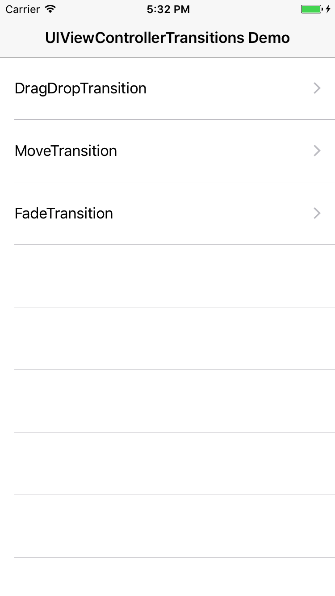

# UIViewControllerTransitions

[](https://travis-ci.org/pisces/UIViewControllerTransitions)
[](http://cocoapods.org/pods/UIViewControllerTransitions)
[](http://cocoapods.org/pods/UIViewControllerTransitions)
[](http://cocoapods.org/pods/UIViewControllerTransitions)
[](https://github.com/Carthage/Carthage)

- It's the easliy library to apply transitioning to between view controller  and other view controller

## Features
- Very simple interface and integration
- Independent to view controllers
- Expandable
- Provide transitions three types
- Support percent driven interactive transtion with pan gesture recognizer

## Import

Objective-C
```objective-c
#import <UIViewControllerTransitions/UIViewControllerTransitions.h>
```
Swift
```swift
import UIViewControllerTransitions
```

## Example


### Using percent driven interactive transition

```swift
override func viewDidLoad() {
    super.viewDidLoad()
    
    let secondViewController = SecondViewController(nibName: "SecondView", bundle: .main)
    let secondNavigationController = UINavigationController(rootViewController: secondViewController)

    let transition = MoveTransition()
    transition.isAllowsInteraction = true

    // Attach view controller to interactive transition for dismission
    transition.dismissionInteractor?.attach(secondNavigationController, present: nil)

    // Attach view controller to interactive transition for presenting
    transition.presentingInteractor?.attach(self, present: secondNavigationController)

    secondNavigationController.transition = transition
}
```

### DragDropTransition Example


```swift
import UIViewControllerTransitions

class DragDropTransitionFirstViewController: UIViewController {
    
    @IBOutlet private weak var imageView: UIImageView!
    
    private lazy var gestureRecognizer: UITapGestureRecognizer = {
        return UITapGestureRecognizer(target: self, action: #selector(tapped))
    }()
    
    private lazy var secondNavigationController: UINavigationController = {
        return UINavigationController(rootViewController: self.secondViewController)
    }()
    
    private lazy var secondViewController: DragDropTransitionSecondViewController = {
        return DragDropTransitionSecondViewController(nibName: "DragDropTransitionSecondView", bundle: .main)
    }()
    
    override func viewDidLoad() {
        super.viewDidLoad()
        
        self.title = "First View"
        self.view.addGestureRecognizer(gestureRecognizer)
    }
    
    @objc private func tapped() {
        let transition = DragDropTransition()
        transition.isAllowsInteraction = true
        transition.sourceImage = imageView.image
        transition.interactionDelegate = secondViewController
        transition.interactionDataSource = secondViewController
        transition.dismissionInteractor?.attach(secondNavigationController, present: nil)
        
        let w = self.view.frame.size.width
        let statusBarHeight = UIApplication.shared.statusBarFrame.size.height
        let navigationBarHeight = self.navigationController!.navigationBar.frame.size.height
        let bigRect = CGRect(x: 0, y: statusBarHeight + navigationBarHeight, width: w, height: w)
        let smallRect = imageView.frame
        
        transition.presentingSource = AnimatedDragDropTransitioningSource().from({
            return smallRect
        }, to: {
            return bigRect
        }, rotation: {
            return 0
        }, completion: {
            self.secondViewController.imageView.isHidden = false
            self.imageView.isHidden = true
        })
        
        transition.dismissionSource = AnimatedDragDropTransitioningSource().from({
            return bigRect
        }, to: {
            return smallRect
        }, rotation: {
            return 0
        }, completion: {
            self.imageView.isHidden = false
        })
        
        secondNavigationController.transition = transition
        
        self.navigationController?.present(secondNavigationController, animated: true, completion: nil)
    }
}

class DragDropTransitionSecondViewController: UIViewController, DragDropInteractiveTransitionDataSource, InteractiveTransitionDelegate {
    
    @IBOutlet weak var imageViewHeight: NSLayoutConstraint!
    @IBOutlet weak var imageView: UIImageView!
    
    override func viewDidLoad() {
        super.viewDidLoad()
        
        self.title = "Second View"
        self.edgesForExtendedLayout = .bottom
        imageView.isHidden = true
        
        self.navigationItem.setLeftBarButton(UIBarButtonItem(title: "Close", style: .plain, target: self, action: #selector(close)), animated: false)
    }
    
    override func viewDidLayoutSubviews() {
        super.viewDidLayoutSubviews()
        
        imageViewHeight.constant = self.view.frame.size.width
    }
    
    // MARK: - InteractiveTransition delegate
    
    func didBeginTransitioning() {
        imageView.isHidden = true
    }
    
    func didChangeTransitioning(_ percent: CGFloat) {
    }
    
    func didEndTransitioning() {
        imageView.isHidden = false
    }
    
    // MARK: - DragDropInteractiveTransition data source
    
    func sourceImageForInteraction() -> UIImage? {
        return imageView.image
    }
    
    func sourceImageRectForInteraction() -> CGRect {
        return imageView.frame
    }
    
    // MARK: - UIBarButtonItem selector
    
    @objc private func close() {
        self.dismiss(animated: true, completion: nil)
    }
}
```

### MoveTransition Example


```swift
import UIViewControllerTransitions

class MoveTransitionFirstViewController: UIViewController {
    
    private lazy var secondViewController: UINavigationController = {
        return UINavigationController(rootViewController: MoveTransitionSecondViewController(nibName: "MoveTransitionSecondView", bundle: .main))
    }()
    
    override var prefersStatusBarHidden: Bool {
        return false
    }
    
    override var preferredStatusBarUpdateAnimation: UIStatusBarAnimation {
        return .fade
    }
    
    override func viewDidLoad() {
        super.viewDidLoad()
        
        self.title = "First View"
        
        let transition = MoveTransition()
        transition.isAllowsInteraction = true
        transition.dismissionInteractor?.attach(secondViewController, present: nil)
        transition.presentingInteractor?.attach(self, present: secondViewController)
        
        secondViewController.transition = transition
    }
    
    override func viewWillAppear(_ animated: Bool) {
        super.viewWillAppear(animated)
        
        UIView.animate(withDuration: 0.4, delay: 0, options: UIViewAnimationOptions(rawValue: 0), animations: {
            self.setNeedsStatusBarAppearanceUpdate()
        }, completion: nil)
    }
    
    @IBAction func clicked() {
        self.present(secondViewController, animated: true, completion: nil)
    }
}

class MoveTransitionSecondViewController: UIViewController {
    
    override var prefersStatusBarHidden: Bool {
        return false
    }
    
    override var preferredStatusBarUpdateAnimation: UIStatusBarAnimation {
        return .fade
    }
    
    override func viewDidLoad() {
        super.viewDidLoad()
        
        self.title = "Second View"
        
        self.navigationItem.setLeftBarButton(UIBarButtonItem(title: "Close", style: .plain, target: self, action: #selector(close)), animated: false)
    }
    
    override func viewWillAppear(_ animated: Bool) {
        super.viewWillAppear(animated)
        
        UIView.animate(withDuration: 0.4, delay: 0, options: UIViewAnimationOptions(rawValue: 0), animations: {
            self.setNeedsStatusBarAppearanceUpdate()
        }, completion: nil)
    }
    
    @objc private func close() {
        self.dismiss(animated: true, completion: nil)
    }
}
```

### Customize UIViewControllerTransition

```swift
import UIViewControllerTransitions

class CustomTransition: AbstractUIViewControllerTransition {
    
    override func animationController(forDismissed dismissed: UIViewController) -> UIViewControllerAnimatedTransitioning? {
        let transitioning = AnimatedCustomTransitioning()
        transitioning.duration = 0.4
        return transitioning
    }
    
    override func animationController(forPresented presented: UIViewController, presenting: UIViewController, source: UIViewController) -> UIViewControllerAnimatedTransitioning? {
        let transitioning = AnimatedCustomTransitioning()
        transitioning.duration = 0.4
        transitioning.presenting = true
        return transitioning
    }
}

class AnimatedCustomTransitioning: AnimatedTransitioning {
    
    // Write code here for dismission
    override func animateTransition(forDismission transitionContext: UIViewControllerContextTransitioning) {
    }
    
    // Write code here for presenting
    override func animateTransition(forPresenting transitionContext: UIViewControllerContextTransitioning) {
    }
    
    // Write interative transition began code here for dismission or presenting
    override func interactionBegan(_ interactor: AbstractInteractiveTransition) {
        if self.presenting {
            // for presenting
        } else {
            // for dismission
        }
    }
    
    // Write interative transition changed code here for dismission or presenting
    override func interactionChanged(_ interactor: AbstractInteractiveTransition, percent: CGFloat) {
        if self.presenting {
            // for presenting
        } else {
            // for dismission
        }
    }
    
    // Write interative transition cacelled code here for dismission or presenting and call completion after animation finished
    override func interactionCancelled(_ interactor: AbstractInteractiveTransition, completion: (() -> Void)? = nil) {
        if self.presenting {
            // for presenting
        } else {
            // for dismission
        }
    }
    
    // Write interative transition completed code here for dismission or presenting and call completion after animation finished
    override func interactionCompleted(_ interactor: AbstractInteractiveTransition, completion: (() -> Void)? = nil) {
        if self.presenting {
            // for presenting
        } else {
            // for dismission
        }
    }
}
```

### Apply Custom UIViewControllerTransition

```swift
let transition = CustomTransition()
transition.isAllowsInteraction = true
transition.dismissionInteractor?.attach(secondViewController, present: nil)
transition.presentingInteractor?.attach(self, present: secondViewController)

secondViewController.transition = transition

self.present(secondViewController, animated: true, completion: nil)
```

## Installation

### CocoaPods

[CocoaPods](http://cocoapods.org) is a dependency manager for Cocoa projects. You can install it with the following command:

```bash
$ gem install cocoapods
```

> CocoaPods 1.1.0+ is required to build UIViewControllerTransitions 2.0.0+.

To integrate UIViewControllerTransitions into your Xcode project using CocoaPods, specify it in your `Podfile`:

```ruby
source 'https://github.com/CocoaPods/Specs.git'
platform :ios, '7.0'

target '<Your Target Name>' do
    pod 'UIViewControllerTransitions', '~> 2.0'
end
```

Then, run the following command:

```bash
$ pod install
```

### Carthage

[Carthage](https://github.com/Carthage/Carthage) is a decentralized dependency manager that builds your dependencies and provides you with binary frameworks.

You can install Carthage with [Homebrew](http://brew.sh/) using the following command:

```bash
$ brew update
$ brew install carthage
```

To integrate Alamofire into your Xcode project using Carthage, specify it in your `Cartfile`:

```ogdl
github "pisces/UIViewControllerTransitions" ~> 2.0
```

Run `carthage update` to build the framework and drag the built `UIViewControllerTransitions.framework` into your Xcode project.

## Requirements

iOS Deployment Target 8.0 higher

## Author

Steve Kim, hh963103@gmail.com

## License

UIViewControllerTransitions is available under the MIT license. See the LICENSE file for more info.
