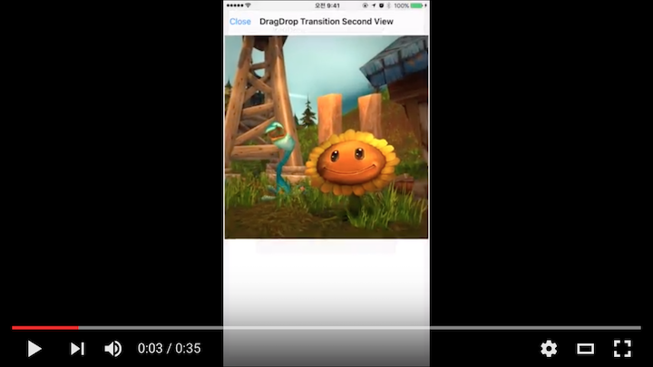
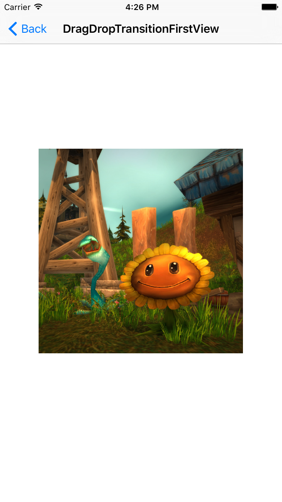
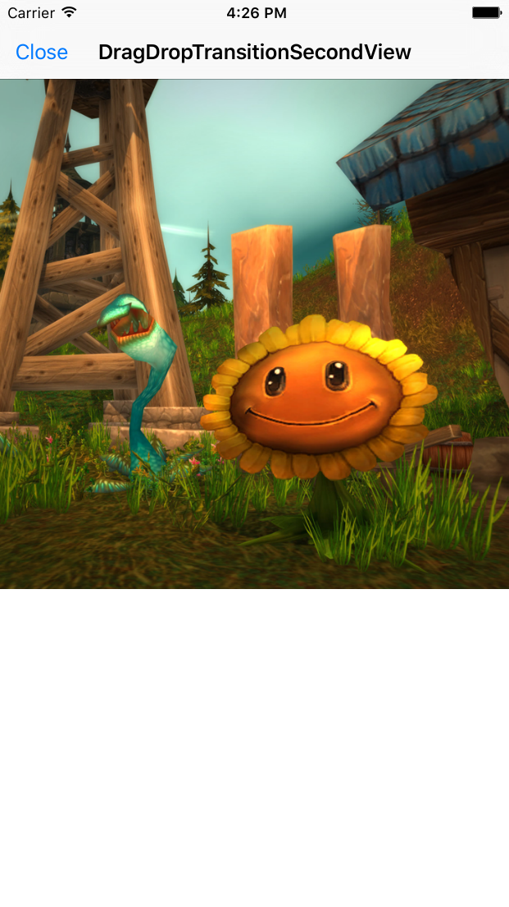
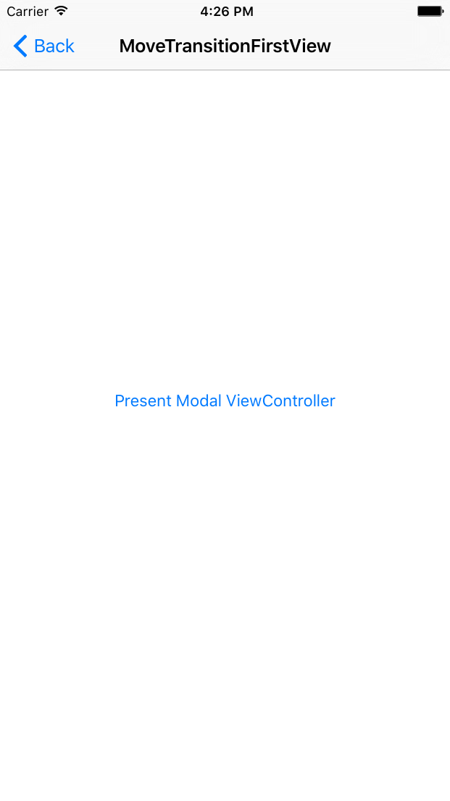
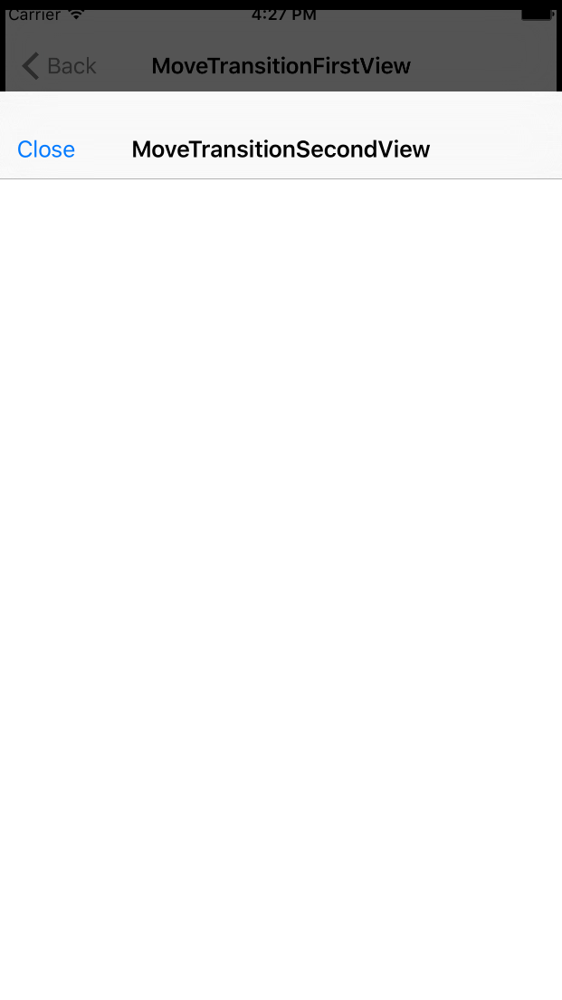

# UIViewControllerTransitions

[](https://travis-ci.org/Steve Kim/UIViewControllerTransitions)
[](http://cocoapods.org/pods/UIViewControllerTransitions)
[](http://cocoapods.org/pods/UIViewControllerTransitions)
[](http://cocoapods.org/pods/UIViewControllerTransitions)

[](https://youtu.be/wIY7EJLmQrk)

## Example

To run the example project, clone the repo, and run `pod install` from the Example directory first.

#### UIViewController DragDrop Transition Example



<br />
In First View Controller
```objective-c
DragDropTransitionSecondViewController *secondViewController = [[DragDropTransitionSecondViewController alloc] initWithNibName:@"DragDropTransitionSecondView" bundle:[NSBundle mainBundle]];

UIViewControllerDragDropTransition *transition = [[UIViewControllerDragDropTransition alloc] init];
transition.sourceImage = imageView.image;
transition.dismissionDelegate = secondViewController;
transition.dismissionDataSource = secondViewController;

const CGFloat w = CGRectGetWidth(self.view.frame);
const CGFloat statusBarHeight = CGRectGetHeight([UIApplication sharedApplication].statusBarFrame);
const CGFloat navigationBarHeight = CGRectGetHeight(self.navigationController.navigationBar.frame);
const CGRect bigRect = CGRectMake(0, statusBarHeight+navigationBarHeight, w, w);
const CGRect smallRect = CGRectMake(CGRectGetMinX(imageView.frame), CGRectGetMinY(imageView.frame), CGRectGetWidth(imageView.frame), CGRectGetHeight(imageView.frame));

transition.presentingSource = [[AnimatedDragDropTransitionSource new] from:^CGRect{
    return smallRect;
} to:^CGRect{
    return bigRect;
} completion:^{
    imageView.hidden = YES;
    controller.imageView.hidden = NO;
}];

transition.dismissionSource = [[AnimatedDragDropTransitionSource new] from:^CGRect{
    return bigRect;
} to:^CGRect{
    return smallRect;
} completion:^{
    imageView.hidden = NO;
}];

UINavigationController *navigationController = [[UINavigationController alloc] initWithRootViewController:secondViewController];
navigationController.transition = transition;

[self presentViewController:navigationController animated:YES completion:nil];
```
<br />
In Second View Controller
```objective-c
#pragma mark - UIViewControllerTransition delegate

- (void)didBeginTransition {
    _imageView.hidden = YES;
}

- (void)didEndTransition {
    _imageView.hidden = NO;
}

#pragma mark - UIViewControllerDragDropTransition data source

- (UIImage *)sourceImageForDismission {
    return _imageView.image;
}

- (CGRect)sourceImageRectForDismission {
    return _imageView.frame;
}
```
<br />
#### UIViewController Move Transition Example


<br />
In First View Controller
```objective-c
MoveTransitionSecondViewController *controller = [[MoveTransitionSecondViewController alloc] initWithNibName:@"MoveTransitionSecondView" bundle:[NSBundle mainBundle]];

UINavigationController *navigationController = [[UINavigationController alloc] initWithRootViewController:controller];
navigationController.transition = [[UIViewControllerMoveTransition alloc] init];

[self presentViewController:navigationController animated:YES completion:nil];
```
<br />
In Second View Controller
```objective-c
You don't need write any code.
```
<br />
### Customize UIViewController Transition

Implement Custom Animated Transition
```objective-c
@implementation AnimatedCustomTransition

// Duration of animation
- (NSTimeInterval)transitionDuration:(id<UIViewControllerContextTransitioning>)transitionContext {
}

// Implement animation for view controller dismission
// Use fromViewController, toViewController is protected variable
- (void)animateTransitionForDismission:(id<UIViewControllerContextTransitioning>)transitionContext {
}

// Implement animation for view controller presenting
// Use fromViewController, toViewController is protected variable
- (void)animateTransitionForPresenting:(id<UIViewControllerContextTransitioning>)transitionContext {
}

@end
```
<br />
Implement Custom UIViewController Transition
```objective-c
@implementation UIViewControllerCustomTransition

- (id <UIViewControllerAnimatedTransitioning>)animationControllerForDismissedController:(UIViewController *)dismissed {
    return [AnimatedCustomTransition new];
}

- (id <UIViewControllerAnimatedTransitioning>)animationControllerForPresentedController:(UIViewController *)presented presentingController:(UIViewController *)presenting sourceController:(UIViewController *)source {
    AnimatedCustomTransition *transition = [AnimatedCustomTransition new];
    transition.presenting = YES;
    return transition;
}

// Implement delegate method for animation begin by gesture
- (void)animateTransitionBegan:(UIPanGestureRecognizer *)gestureRecognizer {
}

// Implement delegate method for animation cancel by gesture
- (void)animateTransitionCancelled:(UIPanGestureRecognizer *)gestureRecognizer {
}

// Implement delegate method for animation to change gesture value
- (void)animateTransitionChanged:(UIPanGestureRecognizer *)gestureRecognizer {
}

// Implement delegate method for animation cancel completion by gesture
- (void)animateTransitionCancelCompleted {
}

@end
```
<br />
Apply Custom UIViewController Transition
```objective-c
UIViewController *controller = [[UIViewController alloc] init];

UINavigationController *navigationController = [[UINavigationController alloc] initWithRootViewController:controller];
navigationController.transition = [[UIViewControllerCustomTransition alloc] init];

[self presentViewController:navigationController animated:YES completion:nil];
```

## Requirements

iOS Deployment Target 7.0 higher

## Installation

UIViewControllerTransitions is available through [CocoaPods](http://cocoapods.org). To install
it, simply add the following line to your Podfile:

```ruby
pod "UIViewControllerTransitions"
```

## Import

Objective-C
```objective-c
#import <UIViewControllerTransitions/UIViewControllerTransitions.h>
```
Swift
```swift
import UIViewControllerTransitions
```

## Author

Steve Kim, hh963103@gmail.com

## License

UIViewControllerTransitions is available under the MIT license. See the LICENSE file for more info.
